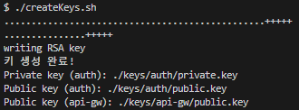

# 과제 (From Nurd Worker)

### 목차

1. 시작하기 앞서
2. 기술 스택
3. 설치 및 실행 방법
4. API 명세서
5. MSA (Infrastructure) - Fully Decoupled MSA
6. MSA (Development) - Kafka
7. Role-Based Access Control (RBAC)
8. 이벤트 보상 작동 방식
9. IaC 구성
10. 느낀 점 & 아쉬운 점

---

### 시작하기 앞서

목차를 보시면 아시겠지만 저는 MSA와 이벤트 기능의 구조를 중심으로 과제를 진행 하였습니다!

최대한 MSA구조를 지키려 DB를 서비스별 분리, Kafka를 사용하여 독립된 두 서비스의 데이터를 연동 시켰습니다.

이벤트 서비스들의 기능은 직접 시나리오를 상상하며 구성하였습니다.

이 주제를 중심으로 읽어주시면 감사드리겠습니다~

---

### 기술 스택

- nestJs
- docker

---

### 설치 및 실행 방법

1. 먼저 github 레포지토리를 클론해주세요~

```yaml
git clone https://github.com/nurdworker/nexon-homework
cd nexon-homework/
```

2. RSA키 방식으로 jwt를 구현했기 때문에 키 생성 커맨드를 꼭 입력해주세요! 안 하시면 서비스내 api 테스트가 대부분 안되실겁니다 ㅠㅠ

```bash
# ~/nexon-homework/ 경로에서 해당 커맨드를 쳐주세요! RSA키가 생성되어야 합니다.
chmod +x createKeys.sh
./createKeys.sh
```

- 해당 커맨드를 입력하시면 루트 디렉토리에 keys 디렉토리가 생성되고 해당 디렉토리를 docker 컨테이너에서 볼륨 마운트 되어 작동합니다!



3. 이후 도커컴포즈 커맨드를 입력하시면 빌드 및 가동이 시작됩니다. (제 컴퓨터 기준 약 5분)

```bash
docker compose up --build
```

!!! 빌드&컨테이너 띄우는 시간이 너무 길어 지루하시면 아래 링크에 접속하셔서 영상을 시청해주세요!

링크 : [https://blog.nurd.work/359](https://blog.nurd.work/359)

- 포스팅 비밀번호 : test123
- 프로젝트를 진행하면서 어떤 사고 회로로 제작하였는지, 프로젝트 타임라인, 썰 등을 간단히 제작한 영상입니다.
- 프로젝트 이후에 제작한 영상이기에 부정행위라고 생각하시면 시청 안 하셔도 됩니다!
- 2025.05.22까지 업로드 할 예정입니다. ( 현재 2025.05.20 과제 제출 전) 이전에 접속하시면 영상이 없을거에요.. 생각보다 편집시간이 많이 걸리거든요.

---

### API 명세서

현재 레포지토리 루트 폴터에 API_SPEC.md 파일로 따로 제작해두었습니다!

---

### MSA (Infrastructure) - Fully Decoupled MSA


- 위 그림과 같이 아키텍쳐를 구상하였고 was, db 모두 각 서비스마다 분리하였습니다.
- 네트워크도 다 구분해놨습니다. AWS네트워크 국비과정에서 VPC가 떠오르더라구요.

---

### MSA (Development) - Kafka


이벤트 서비스에서 이벤트 등록하고.. 유저 보상요청받고 하려면 유저 정보가 필요하잖아요? 때문에 kafka를 통해서 auth에서 메시징을 produce, event에서 consume 하게 제작했습니다.

세가지 토픽을 만들었습니다.

1. user.signUp → 사용자가 회원가입했을때 event서비스에서 copiedUsers컬렉션에 유저정보를 넣어줍니다~ 유저의 \_id값과 닉네임, 이메일등을 produce했습니다.
2. user.token → 사용자가 토큰을 발급 받았을 때를 produce했습니다. event서비스에서 copiedTokenLogs컬렉션에 데이터를 넣어줬습니다. 유저의 보상 요청에 따른 보상조건 충족을 확인할 때 필요했어요.
3. user.sign → 사용자가 로그인&로그아웃 했을 때 produce했습니다. 이것도 유저의 보상 요청에 따른 보상 조건 충족을 확인할 때 필요했어요.

---

### Role-Based Access Control (RBAC)

api-gw → services라는 구조와 api-gw에서 유저를 검증해라? 하자 마자 떠오른게 AWS의 cognito서비스였습니다. 예전에 한번 다뤄봤거든요.

그리고 역할이라고 하니까 전 AWS IAM유저가 생각났어요. 역할이 중복으로 적용가능하기에 코드에서도 역할을 array로 넣어놨습니다.

샘플 관리자인 크로아GM은 operator, auditor 두 권한이 다 있습니다. 일부러 만들어 놓은거에요.

---

### 이벤트 보상 작동 방식


이렇게 두가지 조건으로 이벤트 보상 조건을 만들었는데요.

1. 특정 기간동안 몇 일 로그인 했니?
   → 토큰 발급 기록이 kafka를 구독 consume하니 copiedTokenLogs db에 있을겁니다. 하루라도 토큰이 발급됐다면 로그인 한 것이니 유저Id를 기반으로 이벤트 기간동안 토큰 발급기록을 보면 알 수 있겠죠. 예외상황도 생각해 둬서 아예 토큰 발급로직을 뜯어고쳤습니다. 자정에는 트래픽이 폭발하겠네요~
2. 특정기간동안 몇 시간 로그인 했니?
   → 이건 로그인아웃 로그를 확인했습니다. 로그인or회원가입시엔 signIn로그가 남겨질테고, 로그아웃하면 signOut로그가 남겨질테죠. 다만 웹이다보니 다양한 기계로 로그인했다고 가정하고 그림에서 두번째 줄처럼 signIn, signOut이 두 번 이상 겹치고 할수도 있겠죠. 총 로그인 시간이니 트리거를 앞에서부터 순회하며 signIn이 있을때 어레이생성, signOut이 나왔다고 바로 묶지 않고 다음 로그 확인하고 signIn이 나올때까지 기다렸다가 어레이 묶음. 이런 트리거로 제작했습니다.

---

### IaC 구성

과제 제출 방법이 github레포지토리를 public으로 공개하는 방법이더라구요. 다만 제 프로그램을 iac하는 테스터 분들이 최대한 번거롭지 않게 하려고 고민했습니다. 또한 .env나 키파일이 올라가면 바로 해커들이 달려올 것 같아서 고민을 하다가 아래와 같은 방법을 사용했습니다.

1. auth와 event서비스의 /src/config 디렉토리에 setting.config.ts 파일에 db 생성 정보, 초기에 필요한 sample 데이터(관리자 운영자 데이터값) 등을 미리 설정해두었습니다. 실제 개발에선 이런 민감한 값들을 이렇게 공개된 파일로 관리하는 정신 나간 행동은 하지 않습니다..
2. event와 auth에 둘 다 database 디렉토리가 있는데요. mongo-init.service쪽에서 초기 데이터베이스 db생성과 유저생성 등을 코드로 넣어놨습니다. 또한 회원가입이 불가능한 관리자 회원 데이터들 또한 초기에 미리 넣어뒀어요.
3. README 목차 ‘설치 및 실행 방법’ 에서 키파일 쉘파일을 실행하는 커맨드 추가한 이유도 따로 깃허브 레포지토리에 키파일을 넣고 싶지 않아서 그랬습니다.
4. 서비스간 종속성 때문에 컴포즈 yaml에 depends_on을 적었습니다. 다만 kafka는 컨테이너 뜨고도 안에 프로세스가 길게돌아가길래 kafka api가 통신이 되고부터 종속성 서비스들이 띄워지게 하려했습니다. 찾다보니 wait-for-it.sh파일을 누가 올려뒀길래 가져와서 썼습니다. 쿠버네티스의 livenessProbe같은 기능 같더라구요.

예시) 운영자 데이터 → auth-db가 생성되면 이 운영자 유저 정보들이 처음부터 다 들어 있어요~

| 이메일                                        | 닉네임     | 역할              | 비밀번호 |
| --------------------------------------------- | ---------- | ----------------- | -------- |
| [bera@nexon.com](mailto:bera@nexon.com)       | 베라GM     | operator          | test123  |
| [croa@nexon.com](mailto:croa@nexon.com)       | 크로아GM   | auditor           | test123  |
| [union@nexon.com](mailto:union@nexon.com)     | 유니온GM   | operator, auditor | test123  |
| [elysium@nexon.com](mailto:elysium@nexon.com) | 엘리시움GM | admin             | test123  |

---

### 느낀 점 & 아쉬운 점

**느낀 점**

1. 과제를 하면서 너무 재밋게 했습니다.
2. 출제자의 의도가 점점 보이더라구요. 예를 들어 이벤트는 선택지라고 하셨는데 서비스가 총 api-gw, auth, event세 개잖아요? 근데 MSA가 주제다보니 이벤트를 사용자 접속 등 로그인 조건으로 만들라는 의도가 있다고 생각이 들었습니다. 맞나요?
3. 예전에 was단까지 MSA구조를 만들어봤는데 DB는 사실 감이 안잡혔었거든요? 근데 이번 과제 덕에 DB까지 MSA로 구분하려다 보니 kafka라는 개념도 알게 되고 너무 뜻깊었습니다.
4. nest js 가 잘 알면 너무 좋을 것 같습니다! 특히 모듈화? 깔끔하게 관리되는게 너무 맘에 들더라구요. express만 써봐서 아직은 잘 모르지만 이번 기회에 앞으로는 백엔드를 주로 nest js 프레임워크로 구축할 생각입니다.

**아쉬운 점**

1. 에러처리를 제대로 못했습니다 ㅠㅠ next js 프레임워크를 거의 처음 만져보다 싶이 했고 시간이 굉장히 촉박해서 일단 과제에 나온 태스크부터 해야겠다고 생각했어요. 조금만 시간이 더 주어진다면 할 수 있을 것 같은데 굉장히 아쉬운 부분이었어요.
2. 코드 묶음의 독립성에 따라서 동기&비동기 처리를 하려고 했으나 역시나 시간이 부족해서 못했습니다..
3. 컨테이너의 로그들을 수집하여 로그파일에 저장하는 기능을 만드려했는데 에러처리를 다 못해서 역시나 못했습니다. winston패키지만 깔아놨네요..
4. jwt 로그인 로직을 과제에서 제시해주신 프레임워크를 사용하니 이렇게 간단 하다는거에 놀랐습니다. 저는 항상 HMAC방식? 으로 했거든요. 다만 refresh 토큰으로 access 토큰 갱신 시 access token의 만료 조건을 and조건으로 묶는다는 제 나름의 방식이 깨졌습니다. 또한 api gw쪽에서 인터셉터를 달아서 무한로그인을 해볼까 생각을 헀었는데 시간도 없고 라이브러리다보니 설정을 만질 수가 없더라구요. 프론트의 인터셉터에서 해야할 듯 합니다.
5. README에서는 안 적었지만 개발 환경 구성과 MSA구조, iac과정에 거의 4~5일을 썼습니다. 개발 시간이 2일밖에 없어서 정말 부랴부랴 했습니다.. 시간 배분을 잘 해야겠다고 느꼈습니다.
6. 테스터 함수를 만드려고 각 서비스마다 test디렉토리로 만들었는데 못 만들었네요 ㅠ
7. window노트북+WSL구조로 도커 관리하느라 코드 수정 후 테스트가 불편했습니다. aws sam cli가 생각나더라구요.. 수정하고 최소 30초후에 테스트가 가능했고 가끔 컨테이너가 고장나기도 했어요. 맥은 괜찮은가 싶더라구요. 
